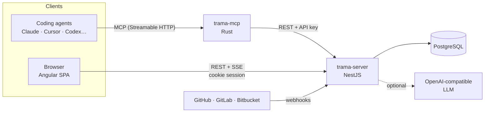

<div align="center">

<a href="https://trama.alessandrobrunoh.it">
  <picture>
    <source media="(prefers-color-scheme: dark)" srcset="public/icons/trama-horizontal-white.svg">
    
  </picture>
</a>

### Issues describe problems. Workstreams deliver outcomes.

**Trama is the source-available coordination layer for software teams that work with coding agents.**<br>
Issues are the demand, workstreams are the outcome, decisions and artifacts are the proof, and humans are pulled in only where they are needed.

[](LICENSE)
[](https://angular.dev)
[](https://nestjs.com)
[](https://www.postgresql.org)
[](mcp/README.md)
[](CONTRIBUTING.md)

[**Live instance**](https://trama.alessandrobrunoh.it) ·
[Vision](VISION.md) ·
[Non-goals](NON-GOALS.md) ·
[API reference](server/API.md) ·
[MCP server](mcp/README.md) ·
[Agent skills](skills/README.md) ·
[Contributing](CONTRIBUTING.md)

</div>

---

## Why Trama

Trello, Jira and Linear treat every ticket as a unit of work. That held up while one issue meant one person and one pull request. It breaks down when:

- several issues share the **same root cause** and should be fixed together;
- a **coding agent** does a large part of the work, and delegates to subagents;
- the change spans **several repositories** and teams;
- the *why* behind a choice lives in a chat thread nobody can find in a month.

> **Issues are excellent units of demand. They are not always the best units of execution.**

Trama doesn't replace issues, it keeps them first-class, and it does not copy what your execution tools already hold (transcripts, prompts, file edits): it links to them. It adds the layer between "someone reported a problem" and "we shipped the fix".

```text
  Issues          "What problems or requests exist?"
     │
     ▼
  Workstream      "What outcome are we pursuing?"          ← the new unit
     │
     ▼
  Decisions       "Why did we choose this?"
  Artifacts       "What did the work actually produce?"    ← PRs, builds, docs, deployments
     │
     ▼
  Outcome         "What did we deliver?"
```

The name is Italian for *weft*: the thread that runs across a loom and turns separate strands into one fabric. Read the thesis in [VISION.md](VISION.md) (two pages) and what Trama deliberately does not do in [NON-GOALS.md](NON-GOALS.md). The original long-form write-up is kept as background in [docs/vision-detailed.md](docs/vision-detailed.md).

> **Status:** early-stage and not yet considered production-ready (see [SECURITY.md](SECURITY.md)). The scope is under review: [NON-GOALS.md](NON-GOALS.md) proposes which surfaces are core and which are frozen.

## Core ideas

| Concept | What it is |
|---|---|
| **Issue** | A problem, request or task: bug, feature, incident, tech debt, feedback, idea, security finding. Keyed like `BUG-142`. |
| **Workstream** | The outcome a team commits to. Groups issues that share a root cause, carries acceptance criteria, contributors, milestones and dependencies. Keyed like `AUTH-42`. |
| **Decision** | A first-class record (`ADR-21`): proposed, accepted, superseded or rejected, with the reasoning kept next to the work. |
| **Artifact** | Proof of delivery: pull/merge requests, builds, test reports, designs, deployments, releases, with live CI and review state. |
| **Input request** | An agent that is blocked asks a human a question and waits, instead of guessing. |
| **Attention** | A queue of what needs *human* judgment right now: reviews, decisions, failing CI, conflicts, triage. Human attention is the scarce resource. |
| **Project** | A planning entity above workstreams (goals, milestones, updates), separate from repositories. Supporting, not core. |

**Reality drives status.** A workstream's state (`draft → planned → working → needs_input → in_review → blocked → ready_to_land → shipped`) is derived from facts (issues resolved, PRs merged, criteria met, open questions, dependencies) and not from someone dragging a card. You can still pin it manually when you need to.

## Features

**Core**

- **Workstreams** with acceptance criteria, contributors, a dependency graph, and list / board / graph views. Status is derived from facts.
- **Humans and agents as actors.** Agents are first-class members with scoped tokens, usage caps and an auditable activity trail. Accountability stays with a human.
- **Decisions and artifacts** traced back to the issues they came from. Agents propose decisions; humans accept them.
- **Input requests and an attention inbox** that surface where a person is actually needed.
- **Git integrations**: GitHub, GitLab and Bitbucket Cloud, including self-hosted GitLab and GitHub Enterprise. Import repositories, link PRs, receive webhooks.
- **MCP server** (Rust) for Claude, Cursor, VS Code or any MCP client: <!-- mcp-tools-count:start -->21 task-oriented tools by default (the `core` profile; the whole catalog stays one switch away)<!-- mcp-tools-count:end -->. Everything else is one `list_capabilities` away, or switch to `TRAMA_MCP_PROFILE=full`. Plus a **CLI** with the same commands, always on the full catalog.
- **Agent skills** that teach a coding agent how to pick up work, report progress, ask for input and triage.
- **Live updates** over SSE, a command palette, keyboard shortcuts, search, roles and API tokens with narrow scopes.
- **Self-hosting first**: one PostgreSQL, three small images, no large infrastructure stack.

**Supporting (scope under review, see [NON-GOALS.md](NON-GOALS.md))**

- Projects with milestones and updates, teams, repositories, saved views, customers and customer feedback linked to issues, outgoing webhooks, notifications (in-app and email), an installable PWA.
- An optional built-in assistant and "suggest improvements" for any OpenAI-compatible model. Off by default; keys stay on the server.
- Statistics, a timeline, a roadmap page and marketing pages exist in the app today and are proposed for removal or merging.

**Not built yet:** importing or linking issues from an existing tracker (GitHub Issues, Linear, Jira), and guided onboarding.

## How it fits together



The MCP server holds **no data and no secrets**. Each client connects with its own API key, and the API stays the only authority: permissions, roles and usage caps are enforced there.

## Quick start

**Requirements:** Node.js 22+, Docker (for PostgreSQL). The MCP server additionally needs a Rust toolchain if you run it from source.

```bash
git clone https://github.com/alessandrobrunoh/trama.git
cd trama

# 1. API: Postgres, migrations and a seeded demo workspace
cd server
cp .env.example .env
npm install
npm run db:up          # PostgreSQL on localhost:5434
npm run start:dev      # http://localhost:3000/api

# 2. Web app (in another terminal, from the repo root)
npm install
npm start              # http://localhost:4300
```

Open <http://localhost:4300> and sign in with the seeded demo account:

```text
demo@trama.dev  /  trama-demo      (workspace: acme)
```

Set `SEED_DEMO=false` to start with an empty database instead.

### Connect a coding agent

Create a key in **Settings → API tokens**, then:

```bash
# MCP server (local: cd mcp && TRAMA_API_URL=http://localhost:3000/api cargo run)
claude mcp add --transport http trama http://localhost:8787/mcp \
  --header "Authorization: Bearer trm_…"

# Teach the agent how to work in Trama
mkdir -p ~/.claude/skills && cp -R skills/trama* ~/.claude/skills/
```

No MCP, or you prefer a shell? The [`trama` CLI](cli/README.md) is one small binary (macOS, Linux, Windows) with the same commands as the MCP tools:

```bash
curl -fsSL https://raw.githubusercontent.com/alessandrobrunoh/trama/main/cli/install/install.sh | sh
trama login && trama skill install   # sign in, then teach your coding agent the commands
```

Give agents the narrowest permissions that do the job, and keep the default usage caps. More in [mcp/README.md](mcp/README.md) and [skills/README.md](skills/README.md).

## Self-hosting

Three images, one Postgres:

| Image | Serves |
|---|---|
| `ghcr.io/alessandrobrunoh/trama-frontend` | the Angular app (nginx, unprivileged) |
| `ghcr.io/alessandrobrunoh/trama-server` | the API |
| `ghcr.io/alessandrobrunoh/trama-mcp` | the MCP server (distroless) |

```bash
cp server/.env.production.example server/.env.production   # fill in the CHANGE_ME values
docker compose -f server/docker-compose.yml up -d
```

All containers run as non-root with `cap_drop: ALL`, `no-new-privileges` and a read-only filesystem. In production the API refuses to boot without `DATABASE_URL` and `TRAMA_ENCRYPTION_KEY` (integration secrets are encrypted at rest with AES-256). To run it yourself without Traefik or a fixed domain, follow [docs/self-hosting.md](docs/self-hosting.md) (`docker-compose.selfhost.yml`). See [docker/README.md](docker/README.md) for the images and the author's own deployment, and [server/AI.md](server/AI.md) to enable the optional AI features.

## Tech stack

| Layer | Built with |
|---|---|
| **Web** | Angular 22 (standalone, signals), Tailwind CSS 4, Spartan UI + Angular CDK, Lucide icons, service worker |
| **API** | NestJS 12, TypeORM, PostgreSQL, class-validator, argon2, Vitest + Supertest, oxlint |
| **MCP** | Rust, Streamable HTTP and stdio, tool catalog generated from the API's permission model |
| **Delivery** | Multi-stage Docker builds, Traefik, GitHub Container Registry |

## Repository layout

```text
.
├── src/            Angular app: core (state, services), features (product areas), shared, ui
├── server/         NestJS API: src/, unit tests beside code, e2e in test/
├── mcp/            MCP server in Rust (tools.json is the catalog)
├── cli/            `trama` command line in Rust, generated from the same catalog
├── skills/         SKILL.md packs that teach agents to work in Trama
├── contracts/      Shared domain types, synced into the server by scripts/sync-contracts.mjs
├── docker/         nginx config and deployment guide
└── public/         static assets, logos, PWA manifest
```

## Development

```bash
# Web (repo root)
npm start                 # dev server on :4300, proxies /api to :3000
npm run build             # production build
npm test                  # Angular tests

# API (server/)
npm run start:dev         # watch mode
npm test                  # unit tests (Vitest)
npm run test:e2e          # e2e; recreates the trama_core_test database
npm run lint && npm run build
```

> End-to-end tests drop and recreate their own database. Never point `TEST_DATABASE_URL` at data you want to keep.

## Documentation

| | |
|---|---|
| [VISION.md](VISION.md) | The thesis and the core model (authoritative, two pages) |
| [NON-GOALS.md](NON-GOALS.md) | What Trama will not do, and the proposed scope freeze |
| [docs/vision-detailed.md](docs/vision-detailed.md) | The original long-form vision, kept as background |
| [server/API.md](server/API.md) | Every route, auth modes, conventions |
| [server/ARCHITECTURE.md](server/ARCHITECTURE.md) | Request pipeline, modules, extension points |
| [server/AI.md](server/AI.md) | Configuring the assistant and AI suggestions |
| [mcp/README.md](mcp/README.md) | MCP tools, configuration, security notes |
| [cli/README.md](cli/README.md) | The `trama` command line: install, connect, agent mode |
| [skills/README.md](skills/README.md) | Agent skills and how to install them |
| [docs/self-hosting.md](docs/self-hosting.md) | Self-hosting: install, configure, upgrade, backup, rollback |
| [docker/README.md](docker/README.md) | Images, production stack, registry |
| [DESIGN.md](DESIGN.md) | Design language and tokens |

## Contributing

Trama is early-stage and the architecture is still evolving, so design alignment matters as much as code quality. Small fixes, docs, tests and accessibility improvements can go straight to a pull request. For anything touching the workstream model, permissions, integrations, MCP or the database schema, please open an issue or discussion first.

Read [CONTRIBUTING.md](CONTRIBUTING.md), sign the [CLA](CLA.md) on your first pull request, and follow the [Code of Conduct](CODE_OF_CONDUCT.md). If you find a vulnerability, follow [SECURITY.md](SECURITY.md) rather than opening a public issue.

## License

Trama is **source-available** under the [PolyForm Shield License 1.0.0](LICENSE).

| You can | You can't |
|---|---|
| Use it, for yourself or inside your company | Use it to build a product or service that competes with Trama |
| Read, modify and self-host it | Resell it, or offer it as a hosted service in competition with Trama |
| Fork it and contribute back | Remove the license and notices ([NOTICE](NOTICE)) |

Want to do something the license doesn't allow, such as a commercial or hosted offering? Get in touch for a separate license.

Contributions are welcome. By opening a pull request you agree to the [Contributor License Agreement](CLA.md): you keep your copyright, and the maintainer can distribute your work under this license and under other terms in the future.

This is a summary, not legal advice. The [license text](LICENSE) is what counts.

<div align="center">
<br>
<sub>Built for teams where humans and agents ship together.</sub>
</div>
